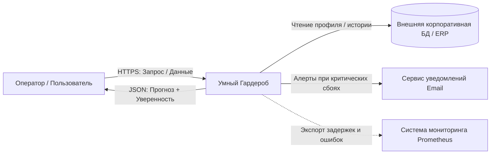
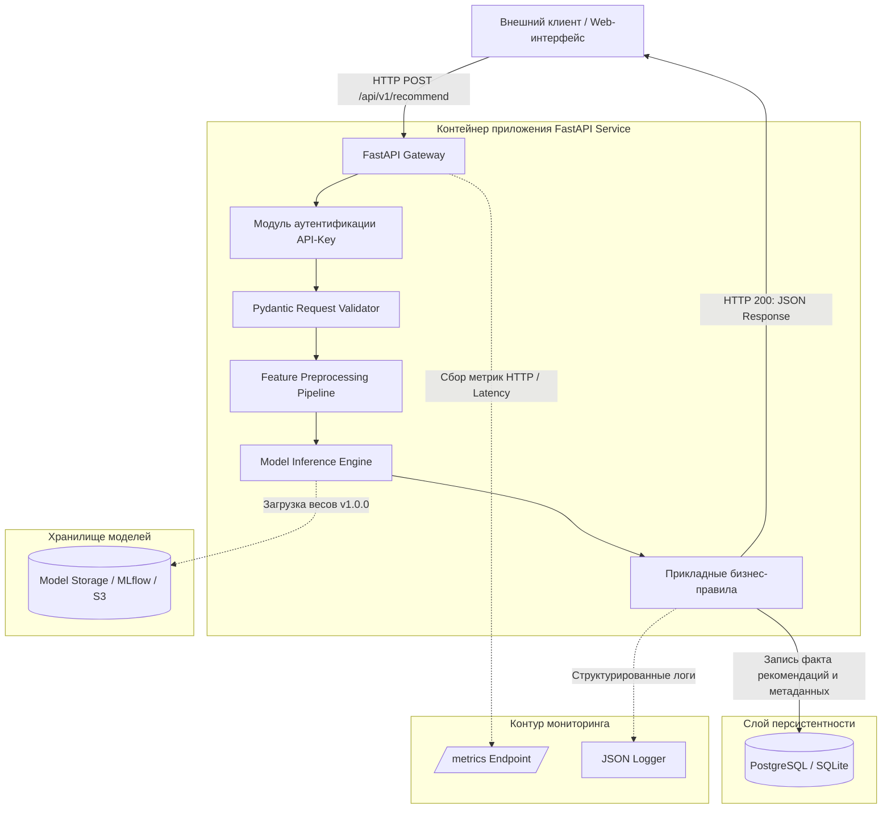

# ai-system-smart-wardrobe

### Бизнес-цель ###
Сервис решает проблему автоматического подбора и рекомендации одежды для пользователя на основе анализа его гардероба, погодных условий, личных предпочтений.

#### Конечный пользователь 
Клиент - получает готовые рекомендации образов.

### Метрики эффективности

#### Метрики бизнес-процесса
- Сокращение времени подбора образа пользователем с 20 минут до 40 секунд
- Снижение количества лишних покупок за счет рекомендаций.

#### Технические метрики
- Время ответа сервиса < 200 мс.
- Доступность сервиса — 99.9%.

#### Метрики бизнес-процесса
- F1-score >= 0.65.
- Precision >= 0.68.

### Границы системы (Scope)
- Валидация данных, инференс, логирование, приложение, локальное хранение данных.
- Бухгалтерские проводки, физическое управление станками, юридическое утверждение приказов.

### Таблица требований
| Тип требования | Формулировка требования | Критерий приемки |
|------|-----|-----|
| Функциональное (FR-01) | Загрузка гардероба | Пользователь может загрузить фотографии и характеристики (цвет, тип, сезон) своих вещей в систему. |
| Функциональное (FR-02) | Получение рекомендации | Система возвращает список образов на основе текущей погоды и предпочтений пользователя. |
| Функциональное (FR-03) | Фильтрация невалидных данных | При нарушении схемы возвращается статус 400 Bad Request с указанием поля. |
| Функциональное (FR-04) | Fallback на человека | При уверенности модели < 0.50 получить ответ от оператора о рекомендации. |
| Нефункциональное (NFR-01) | Производительность | Время отклика API не должно превышать 200 мс. |
| Нефункциональное (NFR-02) | Воспроизводимость | Каждый ответ модели содержит метаданные: model_version и request_id. |
| Нефункциональное (NFR-03) | Безопасность | Персональные данные пользователей анонимизированы. |

### Контекстная диаграмма



### Описание информационных потоков

| Поток | Протокол | Частота обращений | Формат полезной нагрузки |
| :--- | :--- | :--- | :--- |
| Пользователь → Система | HTTPS (REST) | По запросу | JSON |
| Система → Пользователь | HTTPS (REST) | По запросу | JSON |
| Система → Корпоративная БД | SQL / REST | При каждом запросе | SQL-запрос |
| Система → Сервис уведомлений | HTTPS (Webhook) | Только при критических сбоях | JSON |
| Система → Prometheus | HTTP (pull) | Каждые 15 секунд (scrape interval) | Метрики в формате Prometheus |

### Компонентная декомпозиция 



### Описание компонентов

| Компонент | Назначение | Технологии |
| :--- | :--- | :--- |
| API Gateway | Точка входа, маршрутизация запросов, аутентификация по API-ключу. | FastAPI + Uvicorn |
| Модуль валидации  | Проверка типов, диапазонов значений, обязательных полей. | Pydantic |
| Модуль предобработки | Нормализация, энкодинг категориальных признаков. | pandas, scikit-learn |
| Модуль инференса | Загрузка весов модели и выполнение предсказания. | scikit-learn / PyTorch |
| Прикладная логика | Сравнение уверенности с порогом, применение бизнес-правил, формирование ответа. | Python |
| Слой хранения| Сохранение логов, фактов инференса, метаданных. | SQLite |
| Хранилище артефактов| Хранение версий моделей, весов, конфигураций. | Локальный каталог / MinIO / MLflow |
| Модуль наблюдаемости| Сбор логов в JSON и метрик для Prometheus. | prometheus-client, logging |


### Таблица компонентов

| Компонент | Назначение модуля | Входные данные | Выходные данные | Используемые библиотеки |
| :--- | :--- | :--- | :--- | :--- |
| app.api.routes | Обработка HTTP-запросов к API подбора образов | HTTP Request | HTTP Response| fastapi, starlette |
| app.api.schemas | Pydantic-схемы валидации: пользователь, погода, параметры запроса | JSON Raw Payload | Строго типизированный объект | pydantic |
| app.ml.preprocessing | Трансформация признаков: энкодинг категорий одежды, нормализация температуры и влажности | Словарь признаков | 	NumPy array, Tensor для модели | numpy, scikit-learn |
| app.ml.inference | Получение от модели рекомендации образов | Подготовленные фичи | Список вещей с вероятностями | torch, joblib |
| app.services.prediction | Оркестрация бизнес-правил: фильтрация по дресс-коду | Сырой запрос + вердикт модели | Готовый бизнес-результат | Python |
| app.repositories | Персистентность фактов рекомендаций и истории носки | Сущность прогноза | Запись в БД | sqlalchemy, aiosqlite |

### Спецификация контрактов REST API
#### Заголовки ####
```
Content-Type: application/json
X-API-Key: <secret_token>
```

```
from pydantic import BaseModel, Field
from typing import Optional
from uuid import UUID

class WeatherContext(BaseModel):
    temperature: float = Field(ge=-50.0, le=50.0, description="Температура воздуха")
    precipitation: str = Field(default="none", description="Тип осадков")

class RecommendRequest(BaseModel):
    user_id: str = Field(description="Уникальный идентификатор пользователя")
    weather: WeatherContext = Field(description="Текущие погодные условия")
    occasion: str = Field(
        default="casual", description="Повод для подбора образа"
    )
    exclude_item_ids: Optional[list[str]] = Field(
        default=None, description="Список ID вещей, которые нужно исключить"
    )

    class Config:
        json_schema_extra = {
            "example": {
                "user_id": "USER_1024",
                "weather": {
                    "temperature": 8.5,
                    "precipitation": "rain"
                },
                "occasion": "work",
                "exclude_item_ids": ["Item_1"], ["Item_12]
            }
        }
```

#### Схема успешного ответа (200 OK) ####
```
class OutfitItem(BaseModel):
    item_id: str = Field(description="ID вещи из гардероба пользователя")
    category: str = Field(description="Категория")
    score: float = Field(ge=0.0, le=1.0, description="Точность вещи для данного образа")

class RecommendResponse(BaseModel):
    request_id: str = Field(description="Уникальный идентификатор запроса")
    user_id: str = Field(description="Идентификатор пользователя")
    recommendation: str = Field(description="Результат")
    confidence: float = Field(ge=0.0, le=1.0, description="Уверенность модели в рекомендации")
    outfit: list[OutfitItem] = Field(description="Список рекомендованных вещей")
    model_version: str = Field(description="Семантическая версия используемой модели")
    needs_user_feedback: bool = Field(description="Флаг необходимости обратной связи от пользователя")
```

#### Пример тела успешного ответа ####
```
{
  "request_id": "9b1deb4d-3b7d-4bad-9bdd-2b0d7b3dcb6d",
  "user_id": "USER_1024",
  "recommendation": "OUTFIT_READY",
  "confidence": 0.87,
  "outfit": [
    { "item_id": "ITEM_101", "category": "top", "score": 0.92 },
    { "item_id": "ITEM_205", "category": "bottom", "score": 0.88 },
    { "item_id": "ITEM_310", "category": "shoes", "score": 0.79 },
    { "item_id": "ITEM_402", "category": "outerwear", "score": 0.85 }
  ],
  "model_version": "1.0.0",
  "needs_user_feedback": true
}
```

#### Спецификация ошибок валидации (400 / 422 Bad Request) ####
```
{
  "error": "VALIDATION_FAILED",
  "detail": [
    {
      "field": "weather.temperature",
      "message": "Value must be less than or equal to 50.0"
    }
  ]
}
```

---

### Системные эндпоинты

#### GET /health — проверка состояния сервиса ####
```
{
  "status": "healthy",
  "model_loaded": true,
  "model_version": "1.0.0",
  "uptime_seconds": 3600
}
```

### ADR-01: Выбор режима инференса (Synchronous REST API vs Asynchronous Message Queue)

- **Статус:** Принято (Accepted)
- **Контекст:** 
  Сервис «Умный гардероб» получает запрос от мобильного приложения пользователя. Запрос содержит профиль пользователя, текущую погоду и повод. Пользователь ожидает ответ в режиме реального времени. Альтернатива — асинхронная обработка через очередь сообщений — потребовала бы отдельный обработки, усложнила бы структуру и увеличила задержку ответа.
- **Рассмотренные альтернативы:**
    **Synchronous REST API (FastAPI + Uvicorn)** — клиент отправляет запрос и ждёт ответа.
    **Asynchronous Message Queue (RabbitMQ / Kafka)** — клиент публикует задачу, сервис обрабатывает её в фоне и возвращает результат через callback или polling.
- **Решение:** 
  Выбран **Synchronous REST API на FastAPI**.
- **Обоснование:** 
  Для задачи подбора образа задержка в 200 мс приемлема, а пользователь ожидает мгновенного ответа. Асинхронная очередь бы усложнила бы отладку и потребовала бы отдельного сервиса-брокера. FastAPI обеспечивает высокую производительность, автоматическую документацию и простоту тестирования.
- **Последствия:**
    **Преимущества:** простота реализации, низкая задержка, лёгкая отладка, автоматическая валидация через Pydantic.
    **Риски:** Есили будут большие запросы, их придётся обрабатывать отдельно.

  ### ADR-02: Стратегия хранения и версионирования моделей и артефактов

- **Статус:** Принято (Accepted)
- **Контекст:** 
  ML-модель рекомендаций образов периодически обновляется: по мере накопления новых данных модель переобучается - обычно раз в месяц. Каждое обновление создаёт новую версию весов модели, которые могут весить много. Возникает вопрос: где хранить артефакты модели, чтобы обеспечить воспроизводимость и возможность отката?
- **Рассмотренные альтернативы:**
    **Хранение весов модели в Git** — просто, но репозиторий замедляется.
    **Хранение в S3-хранилище (MinIO) + DVC-файлы в Git** — веса лежат отдельно, в Git ссылки. Воспроизводимость по хэшу.
- **Решение:** 
  Выбран **комбинированный подход**: В Git попадают только метаданные, а сами веса лежат в локальной папке.
- **Обоснование:** 
  Хранение весов в Git репозиторий сильно увеличивает вес репозитория. В Git попадают только маленькие текстовые, а сами веса лежат в объектном хранилище. Это даёт воспроизводимость и чистоту репозитория.
- **Последствия:**
    **Преимущества:** лёгкий репозиторий, воспроизводимость экспериментов, возможность отката к предыдущей версии модели.
    **Риски:** при работе на нескольких устройствах нужно настроить общий локальный доступ к папкам. 

  ### ADR-03: Архитектурный стиль сервиса (Модульный монолит vs Микросервисы)

- **Статус:** Принято (Accepted)
- **Контекст:** 
  Сервис «Умный гардероб» включает несколько логических модулей: API, валидацию, предобработку, инференс, бизнес-логику, работу с БД, мониторинг. Возникает вопрос: разворачивать ли каждый модуль как отдельный микросервис или собрать всё в одно приложение?
- **Рассмотренные альтернативы:**
    **Микросервисная архитектура** — каждый модуль отдельный контейнер, общаются по HTTP.
    **Модульный монолит** — все модули в одном Python-приложении, но разделены по пакетам.
- **Решение:** 
  Выбран **модульный монолит**.
- **Обоснование:** 
  На первом этапе проекта нагрузка невелика, а команда — два разработчика. Микросервисы добавили бы избыточные сетевые задержки, усложнили бы локальную отладк, потребовали бы отдельной инфраструктуры. Модульный монолит позволяет быстро итерации, легко тестируется.
- **Последствия:**
   **Преимущества:** простота разработки, низкие задержки, легко отлаживания ошибок.
   **Риски:** При росте проэкта и нагрузки на монолит станет больше, а его улудшение сложнее. Возможны конфликты при параллельной разработке разных модулей.

### Информационная безопасность

- **Аутентификация:** заголовок X-API-Key проверяется в app.api.auth. Неверный ключ выдает 401 Unauthorized.
- **Защита от DoS:** лимит payload до 2 Мб, тайм-аут запроса 5 секунд, rate limiting 50 RPS с одного IP.
- **152-ФЗ и приватность:** передача только по HTTPS, user_id хэшируется перед подачей на инференс, логи не содержат персональных данных.

### Наблюдаемость и аудит

- **Логи:** структурированный JSON на каждый запрос:
  ```
  {"timestamp": "...", "request_id": "...", "user_id_hash": "...", "latency_ms": 12.4, "status": 200, "recommendation": "OUTFIT_READY", "confidence": 0.87, "model_version": "1.0.0"}
  ```
- **Метрики:**
  - `http_requests_total` — счётчик по кодам ответа.
  - `http_request_duration_seconds` — гистограмма задержек.
  - `model_inference_duration_seconds` — время инференса.
- **Дрейф данных:** раз в неделю проверяем, не изменились ли данные пользователей. Если качество модели упало — переобучаем.

### Устойчивость

- **Graceful degradation:** при отсутствии модели - 503 вместо 500.
- **Health-check:** `GET /health` — статус, версия модели, uptime.
- **Бэкап:** БД и папка `models/`.